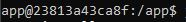

# Basic React App Starter Template

## Docker Setup

### For Windows

1. Open Command Prompt
2. Location file
3. Run `docker-shell.bat`

You have successfully set up your docker container if you get the following in your command line.

## Install npm packages

After your docker container is running, run the following commands. 

`yarn install`

`yarn start`

